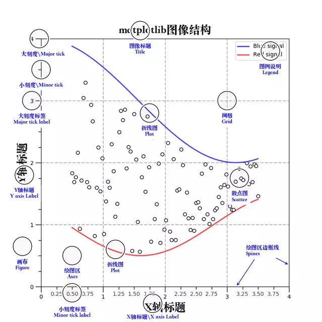

# 简介

matplotlib的图像组成



# Figure画布背景设置

## 单一色彩背景

```
Figure设置单一色彩背景通常有两种方法:

1、创建Figure对象时给定facecolor关键字参数值
   fig = plt.figure(facecolor='snow')
   
2、使用Figure对象的set_facecolor方法
   fig = plt.figure()fig.set_facecolor('blueviolet')
```

## 复合色彩背景

```
Figure设置复合色彩背景步骤:

1、创建色彩数组
   a = [np.linspace(0,1,1600)]*1600
2、通过Figure对象的figimage方法中的cmap关键字设定要设定的背景色彩
   fig.figimage(a, cmap= plt.get_cmap('autumn'))
```

## 图像背景

```
Figure设置图像背景步骤:

1、将图像文件转换成数组
   bgimg = img.imread('./world.png')
2、通过Figure对象的figimage方法将图像设置为背景
   fig.figimage(bgimg)
```

# Axes绘图区

## 绘图布局的创建

```
绘图布局的创建主要有三种方法：

1、axes=figure.add_axes([left,bottom,width,height])
2、fig、axes=pyplot.subplots(nrows,ncols)
3、axes=figure.add_subplot(行号，列数，序号)
```

* 无论使用何种方法创建，每一个axes都是一个独立的图层
* 每个图层除了绘图区以外都是透明的
* 图层之间相互独立互补影响
* 当两个axes绘图区之间有重叠的时候，创建命令在前的axes图层位更靠近底层
* axes.set_zorder()方法改变当前图层层次高度，参数值越小位置越靠近底层


* fig,axes=pyplot.subplots()该方法之间创建出n行，m列的绘图区
* axes=figure.add_subplot()该方法一行命令只能创建一个axes绘图区，即序号参数所指定的那个位置的axes

## 绘图区网格设置

axes.grid(b=None,which='major',axis='both',**kwargs)

```
which参数的值为major,minor,both,默认为major:
1、major只绘制大刻度网格
2、minor只绘制小刻度网络
3、both 绘制全刻度网格

axis为绘制轴
参数为'x','y','both'

ax.grid(color='skyblue')用于设置网格的颜色
ax.grid(linestyle='--')用于设置网格的样式
ax.grid(linewidth=2)用于设置网格的粗细
```

## 图例设置

```
ax.legend方法可以显示图例

通过handles,labels=ax.get_legend_handles_labels()方法可以得到图例的图像列表和文字列表
ax.legend(handles[::-1],labels[::-1])可以将图例顺序颠倒过来
```

# 坐标轴设置

## 改变坐标轴所依附的边框线

* axes.xaxis.set_ticks_position()
* axes.yaxis.set_ticks_position()

两个方法都有四个参数可以设置'bottom','top','both','none'

## 坐标轴设置方向

```
axes.invert_xaxis()
axes.invert_yaxis()
这个两个方法不需要参数
```

## 坐标轴范围设置

```
axes.set_xlim(left,right)
axes.set_ylim(bottom,top)

axes.set_xbound(lower,upper)
axes.set_ybound(lower,upper)
该方法参数部分先后，大的值代表坐标轴的最大值，小的为最小值
```

## 坐标轴刻度线与刻度线标签

```
axes.set_xticks(ticks,minor=False)
ticks值是一个列表，代表刻度线的显示位置；参数minor用于设置主刻度线与副刻度线，默认False，代表主刻度线

axes.set_xticklabels(labels,minor=False)
用于显示x轴上刻度线的标签
```

## 坐标刻度比例尺

```
axes.set_xscale()
axes.set_yscale()

其方法的参数值有四种形式：linear,log,logit,symlog
liner代表默认情况下的线性比例尺，即刻度数值为等差数列

log,logit,symlog代表对数比例尺，即刻度数值为等比数列
log比例尺用于正数区间的数据
logit比例尺用于（0，1）区间内的数据
symlog比例尺用于整个实数区间的数据
```

# 文字显示

```
text()               在图上任意位置显示我们想要显示的文字
xlabel()             用于设置x轴的标签文字
ylabel()             用于设置y轴的标签文字
title()              用于设置图像标题的文字
```

