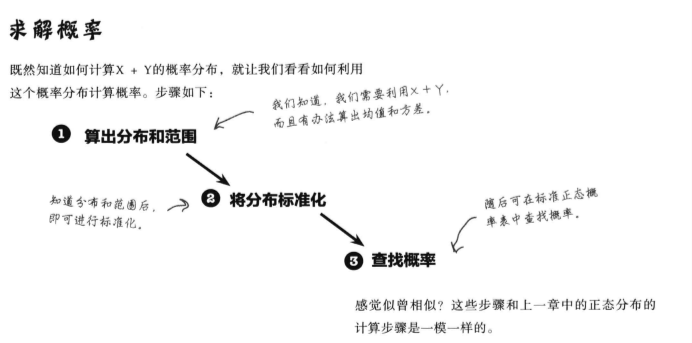
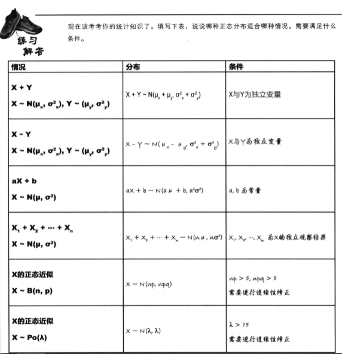
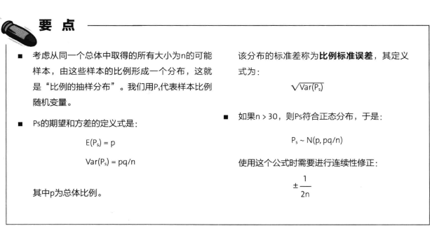
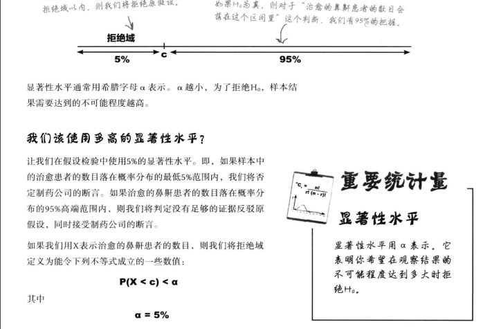
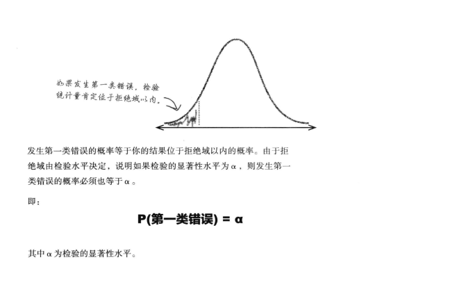
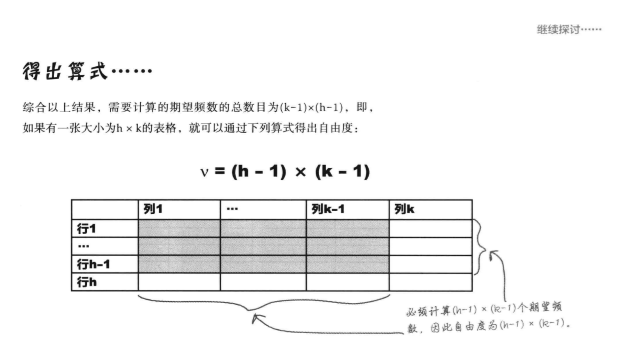

# 简介

描述统计与推论统计笔记

# 描述统计

## 概念

通过图表或数学方法，对数据资料进行整理、分析，并对数据的分布状态、数字特征和随机变量之间关系进行估计和描述的方法。描述统计分为集中趋势分析和离中趋势分析和相关分析三大部分。

* **集中趋势**

  集中趋势分析主要靠平均数、中数、众数等统计指标来表示数据的集中趋势。例如被试的平均成绩多少？是正偏分布还是负偏分布？

* **离中趋势**

  离中趋势分析主要靠全距、四分差、平均差、方差、标准差等统计指标来表示数据的离中趋势。例如，我们想知道两个教学班的语文成绩中，哪个班级内的成绩分布更分散，就可以用两个班级的四分差或百分点来比较

* **相关分析**

  离散变量是指其数值只能用自然数或整数单位计算的则为离散变量.例如,企业个数,职工人数,设备台数等,只能按计量单位数计数,这种变量的数值一般用计数方法取得。

  反之,在一定区间内可以任意取值的变量叫连续变量,其数值是连续不断的,相邻两个数值可作无限分割,即可取无限个数值.例如,生产零件的规格尺寸,人体测量的身高,体重,胸围等为连续变量,其数值只能用测量或计量的方法取得

## 分散性与变异性的度量

度量方法：全距（容易受异常值的影响），四分位距，百分位距

## 期望

* **平均数**

  

* **期望**

* **期望公式**

## 离散概率分布

对于离散概率分布来说，我们关心的是取一个特定数值的概率

* **二项分布**

  

* **几何分布**

  

* **泊松分布**

  

  ​

* **要点**

  

## 连续概率分布

对于连续概率分布，我们关心的是取得一个特定范围的概率

* **正态分布**

  

​    

* **正态分布代替二项分布**

  

* **正态分布代替泊松分布**

  

* **问题**

  .png)

  .png)

* **练习**

  

# 推论统计

## 统计抽样

* **偏倚的来源**

  

* **要点**

  

* **问题**

## 总体和样本的估计

* **点估计量（总体参数未知，根据样本估计总体）**

* **总体方差的点估计**

* **比例的抽样分布（总体参数已知，为样本计算概率**）

* **均值的抽样分布（总体参数已知，为样本计算概率）**

## 置信区间

* **置信区间**

  

* **置信区间与点估计的区别**

* **求解置信区间的四步骤**

  

* **求解置信区间的简便算法**

  

* **t分布与正态分布的比较**

* 求t分布的标准分

## 假设检验

* **步骤**

* **显著水平**

* **单、双尾检验**

* **假设检验要点**

* **两类错误**

* **第一类错误**

* **第二类错误**

* **功效**

## $x^2$(卡方)分布

* **用$x2$检验评估差异**

* **卡方检验的统计量代表什么**

* **$x2$分布的两个主要用途**

* **步骤**

* **拟合优度**

* **求频数**

* **求自由度**

* **卡方检验要点**

